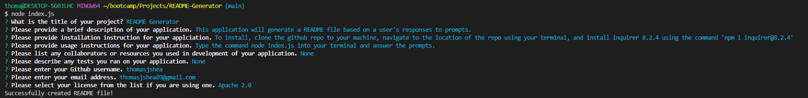

# README Generator

  

  ## Description

  This application is README Generator. It will allow a user to generate a professional README file by answering prompts that are generated by the system. This will allow a developer to save time when generating a README file.
  
  ## Installation
  
  To install, the user will need to clone the [Github Repository](https://github.com/thomasjshea/README-Generator) to their local machine. Using the command line, the user will need to navigate to the repository and install Inquirer 8.2.4 using the command 'npm i inquirer@8.2.4'. The user will also need to have node installed on their machine. 
  
  ## Usage
  
  While still in the command line, the user will need to type in the command 'node index.js'. This will generate the prompts in the command line. The user will answer the prompts and a professional README file will be generated. 

  [Video Guide](https://drive.google.com/file/d/1vw1dIUJdWZZuIeB2kYpJuFwh6JtmWsuZ/view)
  
  

  ## Credits

  I completed this project on my own with no assistance. 

  ## Questions
  
  [Github](https://www.github.com/thomasjshea)

  Email: [thomasjshea89@gmail.com](mailto:thomasjshea89@gmail.com)
  
  ## License
  This application uses the MIT License

  [MIT License](https://choosealicense.com/licenses/mit)
  
  
